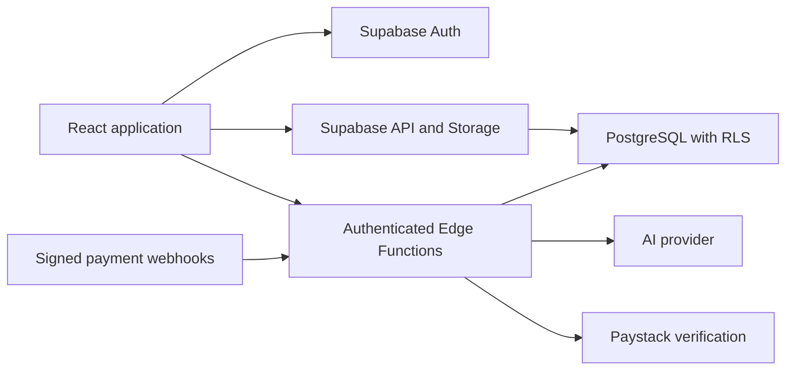

# JobBridge

JobBridge connects candidates with employers through structured profiles, job applications, and recruiting workflows. SkillLink is the candidate experience; JobBridge is the employer workspace.

## Problem

CVs and job descriptions often describe the same skills differently. Employers need an understandable shortlist and a place to manage decisions; candidates need clear application and interview progress. This project combines structured skill scoring with optional semantic matching and keeps the recruiting workflow alongside those signals.

## Features

- Candidates: profile and PDF CV uploads, skills and certifications, job search, locally saved jobs, applications, interviews, and messaging.
- Employers: job publishing, applicant review, shortlist and interview workflows, plan usage, add-on credits, invoices, and team membership.
- Platform: administrator views, private document access, AI-assisted profile extraction and matching, and Paystack payment integration.

## Architecture



The browser handles presentation and ordinary authorized database requests. PostgreSQL enforces ownership and membership. Edge Functions own privileged integrations; payment fulfillment and credit mutations use database transactions. A route guard improves navigation but is never the authorization boundary.

## Tech Stack

| Technology | Purpose |
| --- | --- |
| React and React Router | Component composition and browser routing, including lazy page loading. |
| TypeScript | Strict null and argument checking across the frontend; explicit integration models where introduced. |
| Vite | Development server and production bundle generation without a custom build pipeline. |
| Tailwind and Radix UI | Existing visual system and reusable keyboard/focus-aware primitives. |
| Supabase | Managed authentication, PostgreSQL, Storage, and Deno Edge Functions. |
| PostgreSQL/pgvector | Ownership policies, transactional entitlements, structured scoring, and vector matching. |
| Vitest, Testing Library, PGlite, Playwright | Behaviour tests, real application SQL in an isolated PostgreSQL engine, and browser smoke checks. |

## Frontend Architecture

`src/app/App.tsx` declares routes; feature pages and components live under `src/app/components`. Candidate job cards, filters, and detail presentation have their own feature directory. The employer dashboard delegates its job card presentation to a typed component. UI primitives remain under `components/ui`.

`src/lib/candidate.ts` and `src/lib/employer.ts` are the existing service entry points. Saved-job preferences and pure matching explanations have separate modules. Public employer information and applicant summaries use explicit database projections rather than reading private profile tables. The larger entry points remain incremental refactoring targets.

Local component state holds forms, filters, selections, and dialogs. Auth and theme use React context. Server results use short-lived memory caches and in-flight deduplication. Account transitions invalidate private caches and stale requests cannot repopulate the shared query cache. Saved job IDs are account-scoped local preferences; private query results and employer activity are not persisted by the new code.

Async pages use loading, empty, and error states where implemented; job search includes retry, profile editing includes inline failure feedback, and the application has a render error boundary. Error handling across older pages still needs consolidation.

## Security

Supabase Auth establishes identity. RLS and guarded database functions establish access. Candidate documents are private; employers receive safe applicant summaries before an authorized profile unlock. Roles, ownership, subscription state, and billing balances cannot be assigned through ordinary browser profile updates.

Payment checkout uses a server-created intent with a frozen amount, currency, and entitlement. Fulfillment verifies provider data against that intent. Raw webhook bodies are signature-checked, durable event leases handle retries, and database locks make fulfillment and candidate unlocks idempotent. Recurring invoices also require provider verification. Browser redirects are not proof of payment.

Only public configuration belongs in `VITE_*` variables. Service credentials and integration keys belong in Edge Function secrets. Repository scanning reports paths and classifications without printing matched values.

**Publication is blocked until the owner resolves the historical authentication export.** See [the final readiness report](docs/hardening-report.md) and [the original audit](docs/audit-report.md). Deleting the working-tree file does not remove previous Git objects. The hardening migrations and functions also require staging validation before a production rollout.

## Testing

Run `npm test` for the Vitest suite. It covers authorization/RLS, application readiness, payment intent replay, credit deductions, candidate unlocks, webhook leases, signature/amount validation, auth races, cache invalidation, saved jobs, matching explanations, and profile-save retry.

Database tests apply the complete migration chain unchanged to PGlite with fictional users. Minimal Supabase auth/storage adapters support the tests. This proves application SQL behaviour, but does not replace Supabase gateway, actual Storage, OAuth, or multi-connection concurrency checks.

Run `npm run test:browser` after `npx playwright install chromium`, or set `PLAYWRIGHT_EXECUTABLE_PATH` to an installed Chromium browser. Smoke tests use fictional configuration and block external requests. Authenticated workflows and provider sandbox replay are separate staging checks.

## Local Development

Use Node 24 and npm. From a fresh clone:

```sh
npm ci
```

Copy `src/.env.example` to `src/.env.local` and supply a **local or staging public** Supabase URL/key. The example contains placeholders, not usable credentials. Run `npm run dev`.

For a full local backend, install/start Docker, then use the installed Supabase CLI:

```sh
npx supabase start
npx supabase db reset
```

`db reset` destroys the local database: verify the CLI is targeting the local stack. The schema bootstrap restores missing historical schema definitions for fresh databases; it skips existing core schemas. Skills are seeded through `supabase/seed/skills_seed.sql`. Configure test provider plan codes and Edge secrets separately; reference plans intentionally have no real provider codes.

Start functions with `npx supabase functions serve --env-file supabase/.env.local`. Never put server secrets into frontend environment files. Production rollout instructions and unresolved reconciliation steps are in the readiness report.

## Environment Variables

| Name | Purpose |
| --- | --- |
| `VITE_SUPABASE_URL` | Browser API URL for the selected local/staging project. |
| `VITE_SUPABASE_ANON_KEY` | Public browser key; RLS remains mandatory. |
| `VITE_APP_URL` | Public site origin used for links and metadata. |
| `VITE_ENFORCE_JOB_EXPIRY` | Existing client visibility setting; server policies remain authoritative. |
| `SUPABASE_URL`, `SUPABASE_SERVICE_ROLE_KEY` | Server database access, supplied to Edge Functions. |
| `OPENAI_API_KEY` | Server AI integration key. |
| `PAYSTACK_SECRET_KEY` | Provider initialization, verification, and webhook signature verification. |
| `APP_URL`, `FRONTEND_URL` | Server-selected callback/site origin. |
| `RESEND_API_KEY` | Server email delivery key. |

## Scripts

| Command | What it checks |
| --- | --- |
| `npm run dev` / `npm run build` | Local frontend / production output. |
| `npm run lint` | Frontend, Edge, test, and script lint checks. |
| `npm run typecheck` | Strict frontend and test type checks. |
| `npm run typecheck:edge` | All Edge handler types using pinned Deno dependencies. |
| `npm test` / `npm run test:watch` | Behaviour suite / watch mode. |
| `npm run test:browser` | Isolated public-route browser smoke suite. |
| `npm run test:edge` | Subscription lifecycle event tests with fictional provider data. |
| `npm run security:scan` | Current tracked and nonignored source pattern scan. |
| `node scripts/security-scan.mjs --bundle` | Generated browser output credential pattern scan after build. |
| `node scripts/security-scan.mjs --history` | All reachable historical blobs; intentionally fails until remediation. |
| `npm run validate` | Lint, frontend/test/Edge types, Vitest, Edge tests, current-source scan, and build. |
| `npm run loadtest:smoke` / `npm run loadtest:run` | Existing k6 staging load checks; require k6 and isolated test accounts. |

CI validates pull requests and branch updates; the existing deployment workflow validates before deployment. No production deployment or publication was performed as part of the local hardening.

## Engineering Decisions

Retain the existing stack and use responsibility boundaries where they improve testing. Keep state local/context-based until measured coordination problems warrant a server-state library. Put financial invariants in PostgreSQL transactions, and treat AI output as advisory input rather than an entitlement or authorization decision. See [engineering decisions](docs/engineering-decisions.md) for rationale and trade-offs, and [interview review](docs/interview-review.md) for candid challenges.

## Known Limitations / Future Improvements

Some service and page modules remain large and use legacy `any` values. Generated database types and runtime decoders would strengthen those boundaries. Browse/search and analytics still need broader server pagination and realistic volume measurements. Full provider/OAuth/Storage integration and cross-browser accessibility testing require a staging environment. AI scoring needs evaluation, cost controls, and user-facing transparency; a ranking is not a hiring decision.
